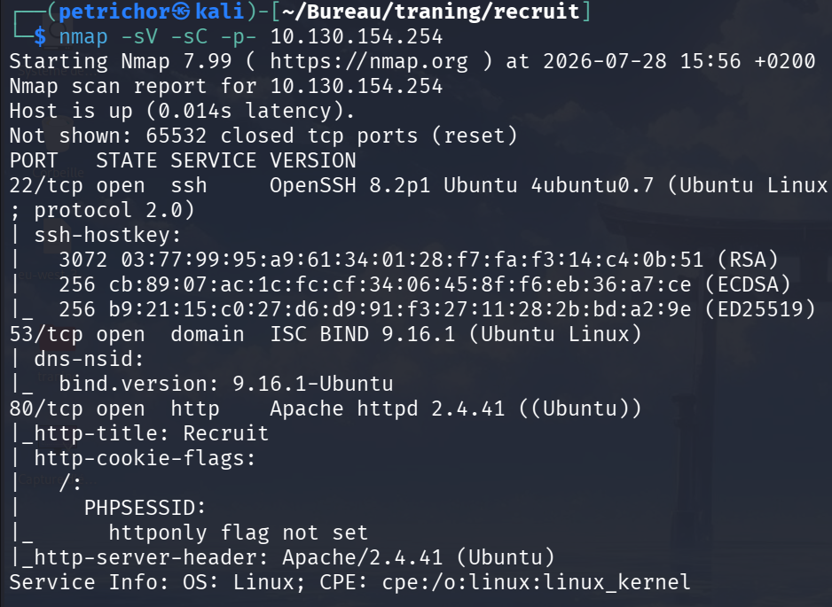
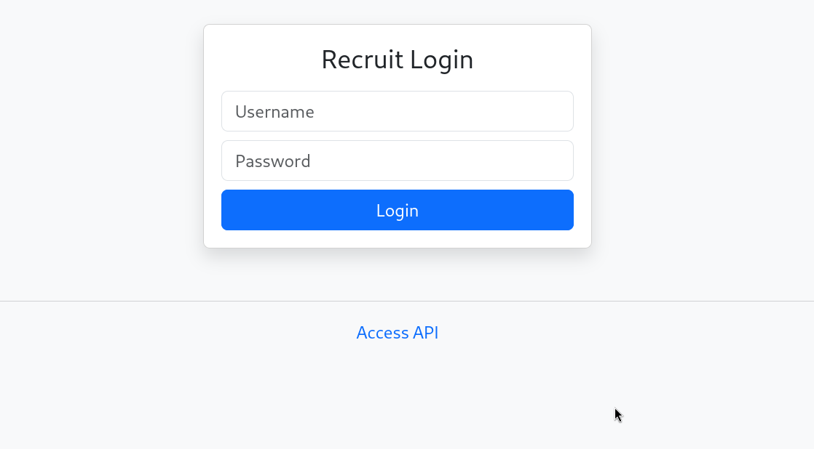
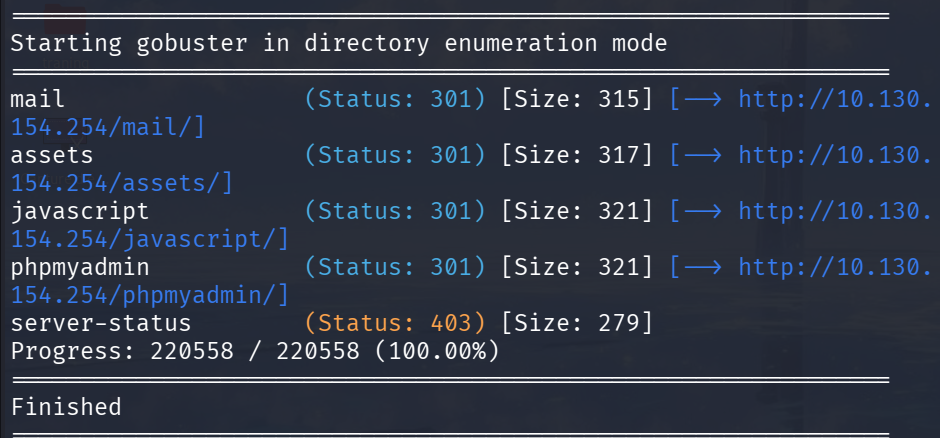
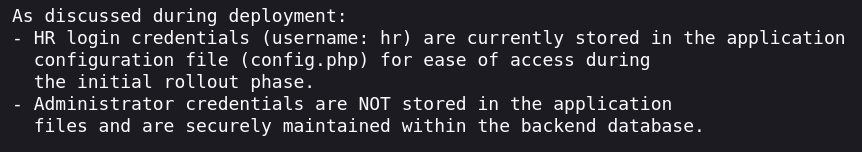
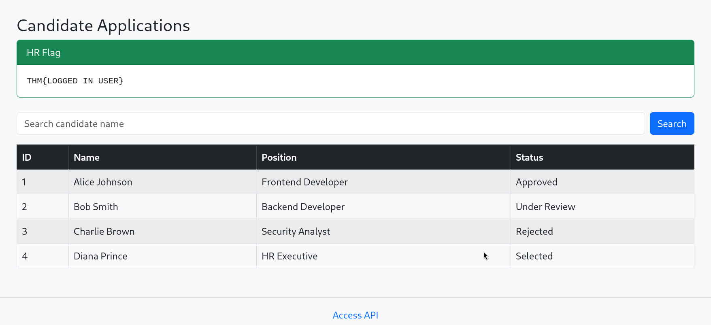
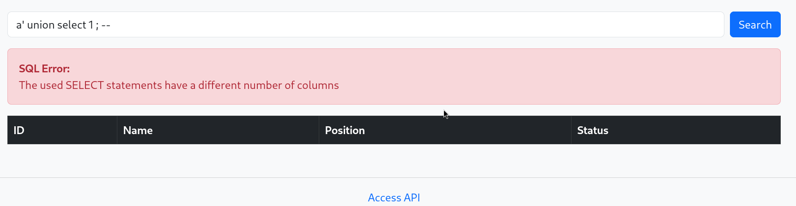
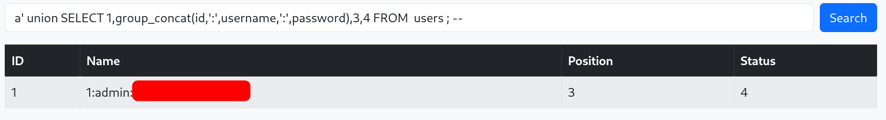
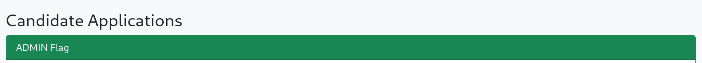

# Writeup: Recruit

## 1. Enumeration & Initial Foothold

After getting the target IP, we will begin by enumerating our target and exploring every possible route that can help get an initial foothold.

We will start with an Nmap scan on the IP.

We got 4 possible open ports, including SSH, DNS, and HTTP.

Let's first look at the web application on port 80.

 

We are looking at a login page with a classic username and password field, and the first thing that grabs my attention is the "access api" link to "http://IP/api.php". Let's take a look at it as it is part of our enumeration phase. 
We get quite a few details about how the API works:
- it is used internally to fetch external CVs
- it does so with the following endpoint: "http://IP/file.php?cv=<URL>"
- the cv parameter can take HTTPS and HTTP URLs
- not all values are allowed for the cv parameter

At this stage, we may be tempted to begin testing a few things with our findings, but for the moment, let's continue our enumeration phase for a bit.

Next, I decided to enumerate some directories with Gobuster, and got the following results with a classic wordlist for this type of challenge, not forgetting the robots.txt and sitemap.xml files which are always worth trying.

 
Looking through these directories, /mail looks like a promising finding, and it did turn out to be interesting because it listed its content, and we can access an unlogged email. In it, there is an exchange between the HR and the IT team. 
 
It says that the HR credentials for the username 'hr' are stored in a PHP config file, "config.php".

Now, on one hand, we have an API that reads files, and on the other, we have a file that contains the HR credentials. So naturally, we go check that file out using the API: "http://IP/file.php?cv=file:///var/www/html/config.php" and we got ourselves the password! (I won't show it here) and we can submit the first flag.

## 2. Exploitation & SQLi

Now our goal is to get admin access level on the server.

From our previous enumeration, we saw that there was a database involved, so I tried a simple quote on the search bar and it provoked a MySQL syntax error.

This indicates that the web application is vulnerable to SQL injection due to improper sanitization of user inputs. Let's exploit that! 

So the query might look something like this:

`select id,... from table where candidat_name like '%form_input%' ...etc`

The admin credentials may or may not be in the same table. In the first case, the query might be filtering them from us, and in the second, we will have to enumerate all the tables, then columns, etc... 

After testing the first hypothesis, nothing came back, so to test the second one we could use SQLMap. But I think in a learning stage, doing it manually is better to understand what is going on.

So the goal here is to get the database name, the table names, then the columns of the table of interest, and finally the values.

We will do a union-based SQL injection which starts like this:

We keep adding columns until the error goes away.
Many rooms about this methodology exist, so I'll skip to the end of the process.

And we finally get the admin flag!

